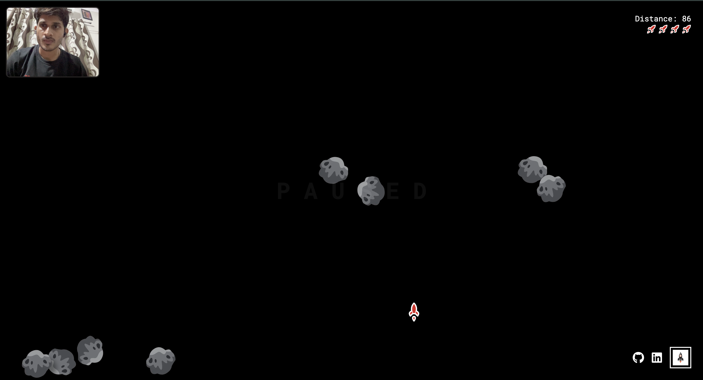

# Meteor Rush

<p align="center">
  
</p>

Meteor Rush is a gesture-controlled browser game built with Next.js and TypeScript. Use your hand gestures (via webcam) to control a rocket and dodge falling meteors. The game leverages real-time hand tracking using MediaPipe and provides an engaging, interactive experience.

---

## Gameplay

<p align="center">
  
  
</p>

- **Control the Rocket:** Use your hands in front of your webcam. The game detects the tilt between your left and right hands to move the rocket left or right.
- **Objective:** Survive as long as possible by dodging meteors. The longer you last, the higher your distance score.
- **Lives:** You start with 4 lives. Colliding with a meteor costs a life. The game ends when all lives are lost.
- **Visual Feedback:** The game overlays your lives, distance, and game state (paused, game over) on the screen.

---

## How to Play

1. **Allow Webcam Access:** When prompted, allow the browser to access your webcam.
2. **Show Both Hands:** Place both hands in view of the camera. The game will detect your hand positions and start.
3. **Tilt to Steer:** Tilt your hands to steer the rocket left or right. Try to avoid the falling meteors!
4. **Survive:** The game tracks your distance and remaining lives. Try to beat your high score!

---

## Getting Started

First, install dependencies:

```bash
npm install
# or
yarn install
# or
pnpm install
```

Then, run the development server:

```bash
npm run dev
# or
yarn dev
# or
pnpm dev
```

Open [Meteror-Rush](https://meteor-rush.vercel.app/) in your browser to play.

---

## Tech Stack
- **Framework:** [Next.js](https://nextjs.org/) (App Router)
- **Language:** TypeScript, React
- **Hand Tracking:** [MediaPipe Tasks Vision](https://www.npmjs.com/package/@mediapipe/tasks-vision)
- **UI:** Tailwind CSS, Lucide React Icons, FontAwesome
- **Audio:** [Tone.js](https://tonejs.github.io/)

 <p align="center">
  
  
</p>


## Project Structure
- `app/` — Next.js app directory (pages, layout)
- `components/` — React components (game logic, UI overlays, hand recognition)
- `utils/` — Utility functions (audio handling)
- `public/` — Static assets (images, audio)

---

## Credits
- Hand tracking powered by [MediaPipe](https://mediapipe.dev/)
- Sound effects and music via [Tone.js](https://tonejs.github.io/)
- Icons from [Lucide](https://lucide.dev/) and [FontAwesome](https://fontawesome.com/)


